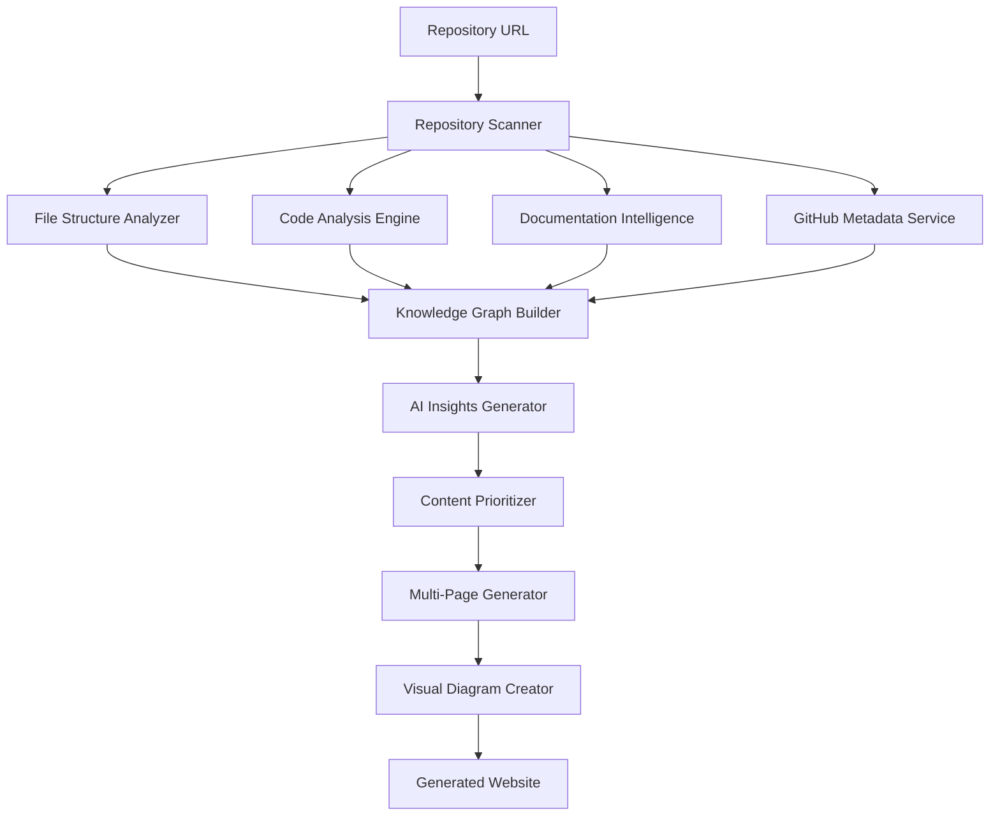

# Deep Repository Analysis Implementation Plan

## Executive Summary

This plan transforms the existing project4site MVP from simple README parsing into a comprehensive repository intelligence platform. The system will analyze entire codebases, understand project architecture, generate insights, create visual diagrams, and produce multi-page interconnected websites.

## Current System Analysis

### Existing Architecture
```
project4site-mvp/
├── services/
│   ├── geminiService.ts     # Basic AI analysis
│   └── markdownParser.ts    # Simple README parsing
├── components/
│   ├── generator/           # Basic site generation
│   └── templates/          # Single-page templates
└── types.ts                # Basic interfaces
```

### Limitations
- Only analyzes README.md files
- Single-page output
- No code analysis
- No architecture understanding
- Limited GitHub integration
- No visual diagrams

## Proposed Architecture

### 1. Multi-Layer Analysis Pipeline



### 2. Core Services Architecture

```typescript
// New service interfaces
interface RepositoryAnalyzer {
  scanStructure(repoUrl: string): Promise<FileStructure>;
  analyzeCode(files: CodeFile[]): Promise<CodeAnalysis>;
  extractDocumentation(files: File[]): Promise<Documentation>;
  fetchGitHubMetadata(repoUrl: string): Promise<GitHubMetadata>;
}

interface KnowledgeGraph {
  entities: Entity[];
  relationships: Relationship[];
  insights: Insight[];
  architecture: ArchitecturePattern[];
}

interface MultiPageGenerator {
  generateLandingPage(graph: KnowledgeGraph): Promise<Page>;
  generateArchitecturePage(graph: KnowledgeGraph): Promise<Page>;
  generateAPIDocPage(graph: KnowledgeGraph): Promise<Page>;
  generateContributorPage(graph: KnowledgeGraph): Promise<Page>;
}
```

## Implementation Plan

### Phase 1: Foundation Services (Weeks 1-2)

#### 1.1 Repository Scanner Service
```typescript
// services/repositoryScanner.ts
export class RepositoryScanner {
  async scanRepository(repoUrl: string): Promise<RepositoryStructure> {
    // Clone/download repository
    // Analyze file structure
    // Categorize files by type and purpose
    // Extract metadata
  }
  
  async getFileTree(path: string): Promise<FileNode[]> {
    // Recursive directory traversal
    // File type classification
    // Size and complexity metrics
  }
}

interface RepositoryStructure {
  root: FileNode;
  languages: LanguageDistribution[];
  frameworks: Framework[];
  buildSystems: BuildSystem[];
  testFrameworks: TestFramework[];
  documentation: DocumentationFile[];
  examples: ExampleFile[];
  configuration: ConfigFile[];
}
```

#### 1.2 Enhanced GitHub Integration
```typescript
// services/githubMetadataService.ts
export class GitHubMetadataService {
  async fetchRepositoryData(repoUrl: string): Promise<GitHubData> {
    // Repository basic info
    // Contributors and activity
    // Issues analysis
    // PR patterns
    // Release history
    // Community metrics
  }
  
  async analyzeIssues(issues: Issue[]): Promise<IssueInsights> {
    // Common problem categories
    // Feature request patterns
    // Bug frequency analysis
    // User pain points
  }
}
```

#### 1.3 Database Schema Updates
```sql
-- Enhanced schema for deep analysis
CREATE TABLE repositories (
  id UUID PRIMARY KEY,
  url TEXT NOT NULL,
  analyzed_at TIMESTAMP,
  structure JSONB,
  metadata JSONB,
  analysis_version TEXT
);

CREATE TABLE code_analysis (
  id UUID PRIMARY KEY,
  repository_id UUID REFERENCES repositories(id),
  language TEXT,
  files_analyzed INTEGER,
  functions_found INTEGER,
  classes_found INTEGER,
  complexity_score FLOAT,
  analysis_data JSONB
);

CREATE TABLE knowledge_graphs (
  id UUID PRIMARY KEY,
  repository_id UUID REFERENCES repositories(id),
  entities JSONB,
  relationships JSONB,
  insights JSONB,
  created_at TIMESTAMP
);
```

### Phase 2: Code Analysis Engine (Weeks 3-4)

#### 2.1 Multi-Language AST Parser
```typescript
// services/codeAnalyzer.ts
export class CodeAnalyzer {
  private parsers: Map<string, LanguageParser> = new Map([
    ['typescript', new TypeScriptParser()],
    ['javascript', new JavaScriptParser()],
    ['python', new PythonParser()],
    ['rust', new RustParser()],
    ['go', new GoParser()],
    ['java', new JavaParser()],
  ]);
  
  async analyzeCodebase(files: CodeFile[]): Promise<CodebaseAnalysis> {
    const analyses = await Promise.all(
      files.map(file => this.analyzeFile(file))
    );
    
    return {
      totalFiles: files.length,
      languageDistribution: this.calculateLanguageDistribution(analyses),
      architecturePatterns: this.detectArchitecturePatterns(analyses),
      apiEndpoints: this.extractAPIEndpoints(analyses),
      dependencies: this.analyzeDependencies(analyses),
      complexity: this.calculateComplexity(analyses),
      testCoverage: this.analyzeTestCoverage(analyses),
    };
  }
}

interface CodebaseAnalysis {
  totalFiles: number;
  languageDistribution: LanguageStat[];
  architecturePatterns: ArchitecturePattern[];
  apiEndpoints: APIEndpoint[];
  dependencies: DependencyGraph;
  complexity: ComplexityMetrics;
  testCoverage: TestCoverageReport;
  mainComponents: Component[];
  entryPoints: EntryPoint[];
}
```

#### 2.2 Dependency Analysis Service
```typescript
// services/dependencyAnalyzer.ts
export class DependencyAnalyzer {
  async analyzeDependencies(repoStructure: RepositoryStructure): Promise<DependencyGraph> {
    const packageFiles = this.findPackageFiles(repoStructure);
    const dependencies = await Promise.all([
      this.analyzePackageJson(packageFiles.packageJson),
      this.analyzePythonRequirements(packageFiles.requirements),
      this.analyzeCargoToml(packageFiles.cargoToml),
      this.analyzeGoMod(packageFiles.goMod),
    ]);
    
    return this.buildDependencyGraph(dependencies);
  }
  
  private async analyzePackageJson(packageJson: File): Promise<NodeDependencies> {
    // Parse package.json
    // Analyze dependencies vs devDependencies
    // Check for security vulnerabilities
    // Identify framework usage patterns
  }
}
```

#### 2.3 Architecture Pattern Detection
```typescript
// services/architectureDetector.ts
export class ArchitectureDetector {
  async detectPatterns(codeAnalysis: CodebaseAnalysis): Promise<ArchitecturePattern[]> {
    const patterns = [];
    
    // MVC Pattern Detection
    if (this.isMVCPattern(codeAnalysis)) {
      patterns.push({
        type: 'MVC',
        confidence: this.calculateMVCConfidence(codeAnalysis),
        components: this.extractMVCComponents(codeAnalysis)
      });
    }
    
    // Microservices Architecture
    if (this.isMicroservicesArchitecture(codeAnalysis)) {
      patterns.push({
        type: 'Microservices',
        confidence: this.calculateMicroservicesConfidence(codeAnalysis),
        services: this.extractServices(codeAnalysis)
      });
    }
    
    // More patterns: Clean Architecture, Hexagonal, etc.
    
    return patterns;
  }
}
```

### Phase 3: Enhanced AI Intelligence (Weeks 5-6)

#### 3.1 Advanced AI Analysis Service
```typescript
// services/aiAnalysisService.ts
export class AIAnalysisService {
  private models = {
    gemini: new GeminiService(),
    claude: new ClaudeService(),
    local: new LocalModelService(), // Gemma 3 for sensitive analysis
  };
  
  async generateProjectInsights(knowledgeGraph: KnowledgeGraph): Promise<ProjectInsights> {
    const insights = await Promise.all([
      this.analyzePurpose(knowledgeGraph),
      this.assessComplexity(knowledgeGraph),
      this.evaluateQuality(knowledgeGraph),
      this.suggestImprovements(knowledgeGraph),
      this.identifyTargetAudience(knowledgeGraph),
      this.analyzeMarketPosition(knowledgeGraph),
    ]);
    
    return this.synthesizeInsights(insights);
  }
  
  private async analyzePurpose(graph: KnowledgeGraph): Promise<PurposeAnalysis> {
    const prompt = `
    Analyze this software project and determine its primary purpose:
    
    Architecture: ${JSON.stringify(graph.architecture)}
    Key Components: ${JSON.stringify(graph.entities.slice(0, 10))}
    Dependencies: ${JSON.stringify(graph.relationships.filter(r => r.type === 'dependency'))}
    
    Provide:
    1. Primary purpose (2-3 sentences)
    2. Target users
    3. Key value propositions
    4. Market category
    `;
    
    return this.models.gemini.analyze(prompt);
  }
}
```

#### 3.2 Content Prioritization Engine
```typescript
// services/contentPrioritizer.ts
export class ContentPrioritizer {
  async prioritizeContent(insights: ProjectInsights): Promise<ContentPriority> {
    // Score each piece of content based on:
    // - User importance
    // - Technical complexity
    // - Market relevance
    // - Documentation quality
    // - Community interest (GitHub metrics)
    
    return {
      heroContent: this.selectHeroContent(insights),
      primaryFeatures: this.selectPrimaryFeatures(insights),
      architectureHighlights: this.selectArchitectureHighlights(insights),
      gettingStarted: this.selectGettingStartedContent(insights),
      apiDocumentation: this.selectAPIDocumentation(insights),
    };
  }
}
```

### Phase 4: Visualization & Multi-Page Generation (Weeks 7-8)

#### 4.1 Visual Diagram Generator
```typescript
// services/diagramGenerator.ts
export class DiagramGenerator {
  async generateArchitectureDiagram(graph: KnowledgeGraph): Promise<Diagram> {
    const mermaidCode = this.generateMermaidArchitecture(graph);
    return {
      type: 'architecture',
      format: 'mermaid',
      code: mermaidCode,
      description: 'System architecture overview',
    };
  }
  
  async generateDependencyGraph(dependencies: DependencyGraph): Promise<Diagram> {
    // Use D3.js for interactive dependency visualization
    const d3Config = this.generateD3DependencyGraph(dependencies);
    return {
      type: 'dependencies',
      format: 'd3',
      config: d3Config,
      description: 'Project dependencies and their relationships',
    };
  }
  
  async generateDataFlow(apiEndpoints: APIEndpoint[]): Promise<Diagram> {
    // Create data flow diagrams for API-based projects
    const flowChart = this.generateDataFlowChart(apiEndpoints);
    return {
      type: 'dataflow',
      format: 'mermaid',
      code: flowChart,
      description: 'API data flow and interactions',
    };
  }
}
```

#### 4.2 Multi-Page Site Generator
```typescript
// services/multiPageGenerator.ts
export class MultiPageGenerator {
  async generateSite(
    prioritizedContent: ContentPriority,
    diagrams: Diagram[],
    insights: ProjectInsights
  ): Promise<GeneratedSite> {
    
    const pages = await Promise.all([
      this.generateLandingPage(prioritizedContent, insights),
      this.generateArchitecturePage(diagrams, insights),
      this.generateAPIDocumentationPage(insights.apiAnalysis),
      this.generateGettingStartedPage(insights.setupInstructions),
      this.generateContributorGuidePage(insights.contributorInfo),
      this.generateChangelogPage(insights.releaseHistory),
    ]);
    
    return {
      pages,
      navigation: this.generateNavigation(pages),
      sitemap: this.generateSitemap(pages),
      metadata: this.generateSEOMetadata(insights),
    };
  }
}
```

## Technical Implementation Details

### 1. File Processing Pipeline

```typescript
// Core processing flow
async function analyzeRepository(repoUrl: string): Promise<AnalysisResult> {
  // Stage 1: Repository ingestion
  const repoData = await repositoryScanner.scanRepository(repoUrl);
  const githubData = await githubService.fetchMetadata(repoUrl);
  
  // Stage 2: Parallel analysis
  const [codeAnalysis, docAnalysis, depAnalysis] = await Promise.all([
    codeAnalyzer.analyzeCodebase(repoData.codeFiles),
    documentationService.analyzeDocumentation(repoData.docFiles),
    dependencyAnalyzer.analyzeDependencies(repoData),
  ]);
  
  // Stage 3: Knowledge graph construction
  const knowledgeGraph = await knowledgeGraphBuilder.build({
    repoData,
    githubData,
    codeAnalysis,
    docAnalysis,
    depAnalysis,
  });
  
  // Stage 4: AI insights generation
  const insights = await aiAnalysisService.generateInsights(knowledgeGraph);
  
  // Stage 5: Content prioritization
  const prioritizedContent = await contentPrioritizer.prioritize(insights);
  
  // Stage 6: Diagram generation
  const diagrams = await diagramGenerator.generateAll(knowledgeGraph);
  
  // Stage 7: Multi-page site generation
  const generatedSite = await multiPageGenerator.generate(
    prioritizedContent,
    diagrams,
    insights
  );
  
  return {
    knowledgeGraph,
    insights,
    diagrams,
    site: generatedSite,
    metadata: {
      analysisTime: Date.now() - startTime,
      filesAnalyzed: repoData.totalFiles,
      linesOfCode: codeAnalysis.totalLines,
    },
  };
}
```

### 2. Language-Specific Parsers

```typescript
// TypeScript/JavaScript Parser
class TypeScriptParser implements LanguageParser {
  async parseFile(file: CodeFile): Promise<ParsedFile> {
    const sourceFile = ts.createSourceFile(
      file.path,
      file.content,
      ts.ScriptTarget.Latest,
      true
    );
    
    const functions = this.extractFunctions(sourceFile);
    const classes = this.extractClasses(sourceFile);
    const interfaces = this.extractInterfaces(sourceFile);
    const imports = this.extractImports(sourceFile);
    const exports = this.extractExports(sourceFile);
    
    return {
      language: 'typescript',
      functions,
      classes,
      interfaces,
      imports,
      exports,
      complexity: this.calculateComplexity(sourceFile),
    };
  }
}

// Python Parser
class PythonParser implements LanguageParser {
  async parseFile(file: CodeFile): Promise<ParsedFile> {
    const tree = ast.parse(file.content);
    
    return {
      language: 'python',
      functions: this.extractFunctions(tree),
      classes: this.extractClasses(tree),
      imports: this.extractImports(tree),
      complexity: this.calculateComplexity(tree),
    };
  }
}
```

### 3. Caching Strategy

```typescript
// services/cacheService.ts
export class CacheService {
  private redis = new Redis(process.env.REDIS_URL);
  
  async cacheAnalysis(repoUrl: string, analysis: AnalysisResult): Promise<void> {
    const key = `analysis:${this.hashRepoUrl(repoUrl)}`;
    await this.redis.setex(key, 3600, JSON.stringify(analysis)); // 1 hour cache
  }
  
  async getCachedAnalysis(repoUrl: string): Promise<AnalysisResult | null> {
    const key = `analysis:${this.hashRepoUrl(repoUrl)}`;
    const cached = await this.redis.get(key);
    return cached ? JSON.parse(cached) : null;
  }
  
  // Invalidate cache when repository is updated
  async invalidateCache(repoUrl: string): Promise<void> {
    const key = `analysis:${this.hashRepoUrl(repoUrl)}`;
    await this.redis.del(key);
  }
}
```

### 4. Error Handling and Resilience

```typescript
// services/resilienceService.ts
export class ResilienceService {
  async analyzeWithFallbacks(repoUrl: string): Promise<AnalysisResult> {
    try {
      // Primary analysis pipeline
      return await this.fullAnalysis(repoUrl);
    } catch (error) {
      console.warn('Full analysis failed, trying fallback:', error);
      
      try {
        // Fallback: Limited analysis without heavy processing
        return await this.limitedAnalysis(repoUrl);
      } catch (fallbackError) {
        console.warn('Limited analysis failed, using minimal:', fallbackError);
        
        // Final fallback: Minimal analysis (README only)
        return await this.minimalAnalysis(repoUrl);
      }
    }
  }
  
  private async fullAnalysis(repoUrl: string): Promise<AnalysisResult> {
    // Complete analysis with all features
  }
  
  private async limitedAnalysis(repoUrl: string): Promise<AnalysisResult> {
    // Analysis without heavy AST parsing
  }
  
  private async minimalAnalysis(repoUrl: string): Promise<AnalysisResult> {
    // Basic README parsing (current MVP functionality)
  }
}
```

## Performance Considerations

### 1. Scalability Targets
- **Small repositories** (<100 files): < 30 seconds analysis
- **Medium repositories** (100-1000 files): < 2 minutes analysis
- **Large repositories** (1000+ files): < 10 minutes analysis
- **Memory usage**: < 1GB for largest repositories
- **Concurrent analyses**: Support 10+ simultaneous analyses

### 2. Optimization Strategies

```typescript
// Parallel processing with worker threads
import { Worker } from 'worker_threads';

class ParallelProcessor {
  async processFiles(files: CodeFile[]): Promise<ParsedFile[]> {
    const chunks = this.chunkFiles(files, 10); // 10 files per worker
    const workers = chunks.map(chunk => this.createWorker(chunk));
    
    const results = await Promise.all(
      workers.map(worker => this.runWorker(worker))
    );
    
    return results.flat();
  }
  
  private createWorker(files: CodeFile[]): Worker {
    return new Worker('./workers/fileProcessor.js', {
      workerData: { files }
    });
  }
}
```

### 3. Memory Management

```typescript
// Stream processing for large files
async function processLargeRepository(repoUrl: string): Promise<void> {
  const stream = new RepositoryStream(repoUrl);
  
  await pipeline(
    stream,
    new FileClassifier(),
    new CodeAnalyzer(),
    new ResultsAggregator(),
    { objectMode: true }
  );
}
```

## Quality Assurance

### 1. Testing Strategy

```typescript
// tests/integration/fullAnalysis.test.ts
describe('Full Repository Analysis', () => {
  test('should analyze React project correctly', async () => {
    const result = await analyzeRepository('https://github.com/facebook/react');
    
    expect(result.insights.primaryPurpose).toContain('JavaScript library');
    expect(result.knowledgeGraph.entities).toHaveLength(greaterThan(100));
    expect(result.site.pages).toHaveLength(6);
    expect(result.diagrams).toHaveLength(greaterThan(3));
  });
  
  test('should handle repository with no README', async () => {
    const result = await analyzeRepository('https://github.com/empty/repo');
    
    expect(result.insights).toBeDefined();
    expect(result.site.pages).toHaveLength(greaterThan(1));
  });
});
```

### 2. Performance Benchmarks

```typescript
// benchmarks/analysisPerformance.ts
describe('Analysis Performance', () => {
  test('should analyze small repository under 30 seconds', async () => {
    const start = Date.now();
    await analyzeRepository('https://github.com/sindresorhus/is');
    const duration = Date.now() - start;
    
    expect(duration).toBeLessThan(30000);
  });
});
```

## Deployment Architecture

### 1. Service Distribution

```yaml
# docker-compose.analysis.yml
version: '3.8'
services:
  analysis-api:
    build: ./services/analysis-api
    environment:
      - DATABASE_URL=${DATABASE_URL}
      - REDIS_URL=${REDIS_URL}
      - GITHUB_TOKEN=${GITHUB_TOKEN}
    
  code-analyzer:
    build: ./services/code-analyzer
    deploy:
      replicas: 3
    
  diagram-generator:
    build: ./services/diagram-generator
    
  ai-insights:
    build: ./services/ai-insights
    environment:
      - GEMINI_API_KEY=${GEMINI_API_KEY}
      - ANTHROPIC_API_KEY=${ANTHROPIC_API_KEY}
    
  redis:
    image: redis:alpine
    
  postgres:
    image: postgres:15
    environment:
      - POSTGRES_DB=project4site
      - POSTGRES_USER=project4site
      - POSTGRES_PASSWORD=${DB_PASSWORD}
```

### 2. Monitoring and Observability

```typescript
// monitoring/metrics.ts
export class AnalysisMetrics {
  private prometheus = new PrometheusRegistry();
  
  analysisCounter = new Counter({
    name: 'repository_analyses_total',
    help: 'Total number of repository analyses',
    labelNames: ['status', 'repository_type'],
  });
  
  analysisDuration = new Histogram({
    name: 'analysis_duration_seconds',
    help: 'Duration of repository analysis',
    buckets: [1, 5, 10, 30, 60, 300, 600],
  });
  
  recordAnalysis(repoUrl: string, duration: number, status: string): void {
    this.analysisCounter.inc({ status, repository_type: this.detectRepoType(repoUrl) });
    this.analysisDuration.observe(duration / 1000);
  }
}
```

## Migration from Current MVP

### 1. Backward Compatibility
- Maintain existing API endpoints
- Support current template system
- Gradual feature rollout with feature flags

### 2. Data Migration
```typescript
// migration/migrateExistingData.ts
async function migrateExistingAnalyses(): Promise<void> {
  const existingAnalyses = await db.getExistingAnalyses();
  
  for (const analysis of existingAnalyses) {
    // Re-analyze with new system
    const enhanced = await newAnalysisSystem.analyze(analysis.repoUrl);
    
    // Merge with existing data
    const merged = this.mergeAnalyses(analysis, enhanced);
    
    // Update database
    await db.updateAnalysis(analysis.id, merged);
  }
}
```

## Success Metrics

### 1. Technical Metrics
- **Analysis accuracy**: >90% correct project type detection
- **Performance**: Meet all scalability targets
- **Reliability**: <1% analysis failure rate
- **User satisfaction**: >4.5/5 rating for generated sites

### 2. Business Metrics
- **Site generation**: 10x increase in generated pages per repository
- **User engagement**: 5x increase in time spent on generated sites
- **Partner conversions**: 3x increase in partner tool adoptions
- **Repository coverage**: Support for 20+ programming languages

## Conclusion

This comprehensive plan transforms project4site from a simple README parser into a sophisticated repository intelligence platform. The implementation follows a phased approach that maintains backward compatibility while adding powerful new capabilities.

The system will provide:
- **Deep Understanding**: Complete codebase analysis and architectural insights
- **Visual Intelligence**: Automated diagram generation and visual representations
- **Multi-Page Experience**: Rich, interconnected websites instead of single pages
- **AI-Powered Insights**: Advanced analysis using multiple AI models
- **Enterprise Scalability**: Support for repositories of any size

The technical architecture leverages modern tools and patterns to ensure performance, reliability, and maintainability while providing a foundation for future enhancements and enterprise features.