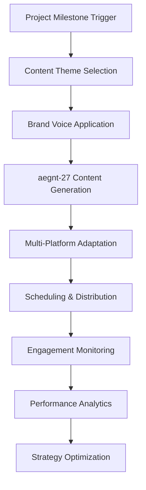

# project4site Content Automation Strategy

> **Autonomous Content Creation & Distribution System**  
> Strategic social media orchestration synchronized with development milestones

## 🎯 Strategic Overview

**Mission:** Build thought leadership and community relationships while developing project4site, creating warm audiences for partnership outreach and user acquisition.

**Approach:** Autonomous content generation and distribution using n8n workflows, aegnt-27 for authenticity, and strategic social engagement.

**Timeline:** Synchronized with ULTRAPLAN milestones for maximum impact.

---

## 🎨 BRAND VOICE OPTIONS

### **Option 1: "The Technical Innovator"** 🔬
**Target Audience:** Senior developers, CTOs, technical decision makers

**Visual Identity:**
- **Colors:** Deep blue (#1a365d), electric green (#00ff88), clean white (#ffffff)
- **Typography:** Monospace headlines, clean sans-serif body text
- **Imagery:** Code snippets, architecture diagrams, technical demos
- **Logo Style:** Minimalist, geometric, tech-forward

**Message Tone:**
- Authoritative but approachable
- Data-driven and evidence-based
- Technical depth with clear explanations
- Focus on innovation and performance

**Mission Statement:**
*"Transforming raw code into professional presentations through AI-powered intelligence."*

**Content Examples:**
- "Our AI processes 50,000+ lines of documentation in under 30 seconds..."
- "Deep dive: How we achieve 95% accuracy in project categorization..."
- "Technical architecture: Building scalable presentation intelligence..."

---

### **Option 2: "The Friendly Guide"** 🌟
**Target Audience:** Beginner developers, bootcamp graduates, indie hackers

**Visual Identity:**
- **Colors:** Warm orange (#ff6b35), friendly blue (#4a90e2), soft gray (#f7f7f7)
- **Typography:** Rounded, approachable fonts with plenty of whitespace
- **Imagery:** Diverse developers, celebration moments, before/after showcases
- **Logo Style:** Friendly, approachable, with subtle personality

**Message Tone:**
- Encouraging and supportive
- Accessible language, minimal jargon
- Celebration of small wins
- Community-focused and inclusive

**Mission Statement:**
*"Every developer deserves a beautiful portfolio - no design skills required."*

**Content Examples:**
- "Just finished your first project? Make it shine! ✨"
- "From coding bootcamp to professional portfolio in 3 clicks..."
- "Your README.md is already amazing - we just make it look that way..."

---

### **Option 3: "The Visionary Disruptor"** 🚀
**Target Audience:** Entrepreneurs, investors, startup founders, tech influencers

**Visual Identity:**
- **Colors:** Bold purple (#6b46c1), gold accent (#f59e0b), dramatic black (#000000)
- **Typography:** Strong, impactful headlines with elegant details
- **Imagery:** Futuristic concepts, growth charts, ambitious visions
- **Logo Style:** Bold, confident, forward-thinking

**Message Tone:**
- Bold and visionary
- Future-focused and ambitious
- Disruption and transformation themes
- Market opportunity emphasis

**Mission Statement:**
*"Revolutionizing how the world discovers and invests in developer talent."*

**Content Examples:**
- "The $50B developer tools market is about to change forever..."
- "We're not building a website tool - we're building the future of work..."
- "Every unicorn started with a GitHub repo - we make them impossible to ignore..."

---

## 🔄 N8N WORKFLOW ARCHITECTURE

### **Master Content Orchestration Workflow**

### **Workflow 1: Milestone-Triggered Content Generation**

**Trigger Sources:**
- GitHub commits and releases
- User milestone achievements (1K, 10K, 50K users)
- Partnership announcements
- Revenue milestones
- Media mentions and awards

**Content Generation Process:**
1. **Milestone Detection** → Webhook from GitHub/analytics
2. **Context Analysis** → AI analyzes recent progress and achievements
3. **Theme Selection** → Maps milestone to content themes
4. **Voice Application** → Applies selected brand voice guidelines
5. **aegnt-27 Generation** → Creates authentic, engaging content
6. **Multi-Platform Adaptation** → Tailors for Twitter, LinkedIn, GitHub

**Content Themes by Milestone:**
- **Week 1-4:** "Building something revolutionary" 
- **Month 1:** "MVP breakthrough moments"
- **Month 3:** "User success stories and testimonials"
- **Month 6:** "Partnership announcements and validation"
- **Month 9:** "Industry thought leadership and insights"
- **Month 12+:** "Market disruption and acquisition signals"

### **Workflow 2: Strategic Social Engagement**

**Daily Engagement Automation:**
- **Follow Strategy:** 10-15 strategic follows per week
- **Comment Strategy:** 5-10 thoughtful comments daily
- **Retweet Strategy:** 3-5 strategic amplifications daily
- **Mention Strategy:** 2-3 strategic mentions weekly

**Target Categories:**

#### **Developer Influencers**
- Kent C. Dodds (@kentcdodds) - React ecosystem
- Dan Abramov (@dan_abramov) - React core team
- Guillermo Rauch (@rauchg) - Vercel CEO
- Lee Robinson (@leeerob) - Next.js developer relations
- Cassidy Williams (@cassidoo) - Developer advocate
- **Engagement:** Technical discussions, tool recommendations, community events

#### **Company Decision Makers**
- Paul Copplestone (@kiwicopple) - Supabase CEO
- Dylan Field (@dylantf) - Figma CEO
- Thomas Dohmke (@ashtom) - GitHub CEO
- Patrick Collison (@patrickc) - Stripe CEO
- **Engagement:** Industry insights, partnership opportunities, strategic discussions

#### **Community Builders**
- Ben Halpern (@bendhalpern) - Dev.to founder
- Quincy Larson (@ossia) - freeCodeCamp founder
- Shawn Wang (@swyx) - Developer advocate
- Emma Wedekind (@emmawedekind) - LogRocket developer advocate
- **Engagement:** Community support, educational content, developer experience

#### **Potential Users**
- Indie Hacker community members
- YC startup founders
- Bootcamp graduates
- Open source maintainers
- **Engagement:** Helpful resources, success celebrations, tool recommendations

### **Workflow 3: Content Scheduling & Distribution**

**Posting Schedule:**
- **Twitter:** 3-5 posts daily (9am, 1pm, 5pm, 9pm EST)
- **LinkedIn:** 1-2 posts daily (8am, 2pm EST)
- **Dev.to:** 2-3 articles weekly
- **GitHub Discussions:** 1-2 community posts weekly

**Content Types by Platform:**

#### **Twitter Content:**
- Quick wins and tips
- Behind-the-scenes development
- User success celebrations
- Industry commentary
- Community engagement

#### **LinkedIn Content:**
- Professional insights and analysis
- Company milestone announcements
- Partnership updates
- Industry thought leadership
- Career and business advice

#### **Dev.to Content:**
- Technical tutorials and guides
- Open source contributions
- Development process insights
- Tool comparisons and reviews
- Community discussions

### **Workflow 4: Engagement Monitoring & Response**

**Monitoring Triggers:**
- Mentions of @project4site or related keywords
- Comments on our posts requiring responses
- DMs requiring follow-up
- Partnership inquiry signals
- User support requests

**Automated Response Categories:**
- **Thank you messages** for positive mentions
- **Support routing** for technical questions
- **Partnership flagging** for business inquiries
- **Community amplification** for user success stories
- **Crisis management** for negative sentiment

### **Workflow 5: Performance Analytics & Optimization**

**Key Metrics Tracking:**
- **Engagement rates** by content type and platform
- **Follower growth** and audience quality
- **Click-through rates** to project4site.com
- **Conversion rates** from social to signups
- **Partnership conversation starts** from social engagement

**Optimization Triggers:**
- Low engagement content gets analyzed and improved
- High-performing content gets amplified and repeated
- Trending topics get incorporated into content calendar
- Partnership opportunities get flagged for manual follow-up

---

## 📅 CONTENT CALENDAR SYNCHRONIZATION

### **Phase 1: Foundation Building (Months 1-3)**

**Week 1-2: Teaser Campaign**
- "Something revolutionary is coming to GitHub..."
- Behind-the-scenes development content
- Founder story and mission sharing
- Developer community engagement

**Week 3-4: MVP Development Content**
- Technical challenges and solutions
- AI development progress
- Community feedback incorporation
- Beta tester recruitment

**Month 2: Beta Launch Campaign**
- Beta announcement and early access
- User onboarding and success stories
- Feature demonstrations and tutorials
- Community building and feedback

**Month 3: Product-Market Fit Evidence**
- User testimonials and case studies
- Metrics and growth milestones
- Partnership opportunity signals
- Industry recognition and validation

### **Phase 2: Partnership Building (Months 4-6)**

**Month 4: Partnership Preparation**
- Thought leadership content on developer tools
- Industry analysis and market insights
- Success story amplification
- Strategic relationship building

**Month 5: Partnership Announcements**
- Official partnership reveals
- Integration demonstrations
- Mutual value proposition content
- Cross-promotion with partners

**Month 6: Partnership Success Validation**
- ROI demonstrations and case studies
- User success stories with partner tools
- Industry thought leadership
- Speaking opportunities and conferences

### **Phase 3: Market Leadership (Months 7-12)**

**Month 7-9: Major Partnership Campaign**
- High-profile partnership announcements
- Industry event speaking and presence
- Media coverage and PR amplification
- Competitive positioning content

**Month 10-12: Acquisition Positioning**
- Strategic value demonstrations
- Market leadership evidence
- Vision and roadmap sharing
- Executive thought leadership

---

## 🎯 STRATEGIC ENGAGEMENT TACTICS

### **Following Strategy**
**Weekly Targets:** 10-15 strategic follows
**Priority Order:**
1. Partnership targets from ULTRAPLAN
2. Developer influencers with engaged audiences
3. Potential customers (startup founders, developers)
4. Industry journalists and analysts
5. Investors and advisors

### **Commenting Strategy**
**Daily Targets:** 5-10 thoughtful comments
**Comment Types:**
- **Value-add insights** on technical discussions
- **Supportive encouragement** for developer achievements
- **Thoughtful questions** that continue conversations
- **Resource sharing** when genuinely helpful
- **Industry expertise** on relevant topics

**Comment Templates (aegnt-27 Generated):**
- "This is exactly the kind of innovation that moves our industry forward..."
- "Love seeing developers build tools that solve real problems..."
- "The developer experience focus here is incredible..."
- "This approach to [specific topic] is brilliant because..."

### **DM Strategy**
**Weekly Targets:** 3-5 warm relationship building DMs
**DM Categories:**
- **Congratulations** on achievements and launches
- **Resource sharing** for relevant opportunities
- **Collaboration exploration** for mutual value
- **Feedback requests** from industry experts
- **Partnership discussions** with warm connections

### **Tagging Strategy**
**Strategic Mentions:**
- Tag relevant people in discussions they'd find valuable
- Mention partners in success story content
- Tag influencers in industry analysis posts
- Mention users in testimonial amplification
- Tag experts in technical discussion posts

---

## 🤖 AEGNT-27 INTEGRATION

### **Authenticity Parameters**
- **Human-like posting patterns** with natural timing variations
- **Conversational tone** that matches selected brand voice
- **Contextual awareness** of current events and trends
- **Emotional intelligence** for appropriate sentiment
- **Technical accuracy** with fact-checking integration

### **Content Generation Guidelines**
- **Maintain brand voice consistency** across all platforms
- **Incorporate current project progress** for authentic updates
- **Respond to trending topics** relevant to developer community
- **Adapt tone** based on audience and platform
- **Include call-to-actions** that drive meaningful engagement

### **Safety Controls**
- **Human approval required** for sensitive or controversial topics
- **Fact-checking integration** for technical claims
- **Sentiment analysis** to avoid posting during negative events
- **Rate limiting** to maintain natural posting patterns
- **Emergency stop** mechanism for crisis situations

---

## 📊 SUCCESS METRICS & KPIs

### **Growth Metrics**
- **Twitter Followers:** 10K by Month 6, 50K by Month 12
- **LinkedIn Connections:** 5K by Month 6, 25K by Month 12
- **Dev.to Followers:** 2K by Month 6, 10K by Month 12
- **Engagement Rate:** Maintain >3% across all platforms

### **Conversion Metrics**
- **Social to Signup:** 15%+ conversion rate from social traffic
- **Partnership Conversations:** 5+ monthly from social engagement
- **Media Mentions:** 10+ monthly industry publication mentions
- **Speaking Opportunities:** 2+ monthly conference/podcast invitations

### **Relationship Metrics**
- **Partnership Target Engagement:** 80% of ULTRAPLAN contacts engaged
- **Influencer Relationships:** 50+ meaningful developer influencer connections
- **Community Building:** 1000+ engaged community members
- **Industry Recognition:** Top 10 developer tool company social presence

---

## 🚀 IMPLEMENTATION CHECKLIST

### **Week 1: Setup & Configuration**
- [ ] Install and configure n8n server
- [ ] Set up social media API integrations
- [ ] Configure aegnt-27 with brand voice parameters
- [ ] Create content template library
- [ ] Establish monitoring and analytics dashboards

### **Week 2: Workflow Development**
- [ ] Build milestone-triggered content generation workflow
- [ ] Create strategic engagement automation
- [ ] Set up performance tracking and optimization
- [ ] Test all workflows with sample data
- [ ] Configure safety controls and approval processes

### **Week 3: Content Planning**
- [ ] Select initial brand voice (recommend Option 2: Friendly Guide)
- [ ] Create 4-week content calendar
- [ ] Identify first 100 strategic engagement targets
- [ ] Prepare launch announcement content
- [ ] Schedule initial teaser campaign

### **Week 4: Launch & Optimization**
- [ ] Launch automated content system
- [ ] Monitor performance and engagement
- [ ] Optimize content based on early feedback
- [ ] Begin strategic relationship building
- [ ] Prepare for Month 2 content themes

---

**🎯 ULTIMATE GOAL:** Build authentic relationships and thought leadership that support our partnership outreach and acquisition positioning while developing genuine community value and engagement.

*This autonomous content strategy creates the foundation for all business development activities while building a sustainable, engaging brand presence across the developer ecosystem.*