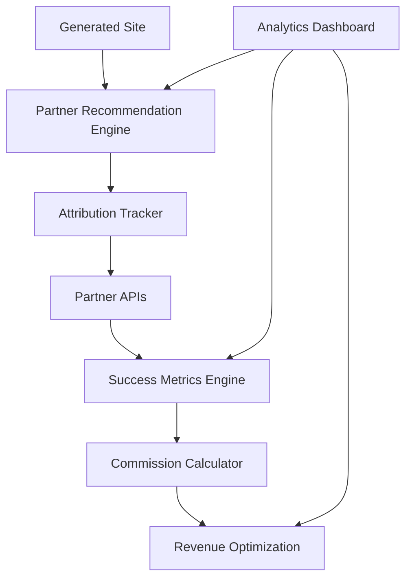

# Developer Toolkit Orchestrator Implementation

> **$10B+ Developer Ecosystem Revenue Engine**  
> Multi-partner API integration system that transforms project4site into a strategic commission-earning platform

## 🎯 SYSTEM OVERVIEW

### **Strategic Vision**
Transform project4site from a simple site generator into the central orchestrator for the entire developer toolkit ecosystem. Every successful developer project becomes a revenue opportunity through strategic partner integrations and success-based commission optimization.

### **Revenue Model Evolution**
```yaml
traditional_model:
  revenue_source: "Subscription fees"
  scaling: "Linear with user growth"
  market_cap: "$50M-500M typical SaaS"

orchestrator_model:
  revenue_source: "Commission on partner tool success"
  scaling: "Exponential with ecosystem growth"
  market_cap: "$10B+ marketplace platform"
```

---

## 🏛️ ARCHITECTURE OVERVIEW

### **Core Services**



### **Technology Stack**
- **Backend**: TypeScript with Bun runtime for maximum performance
- **Database**: PostgreSQL for transactions, Redis for real-time data
- **APIs**: RESTful with GraphQL for complex queries
- **Authentication**: OAuth2 for partners, JWT for internal services
- **Queue**: Redis for asynchronous commission processing
- **Monitoring**: Custom analytics dashboard with real-time metrics

---

## 🔧 PARTNER INTEGRATION FRAMEWORK

### **Partner Configuration System**

```typescript
// services/partner-integration/src/types/partner.ts
export interface PartnerConfig {
  id: string;
  name: string;
  displayName: string;
  description: string;
  apiBase: string;
  authType: 'oauth2' | 'api_key' | 'bearer_token';
  commissionRate: number;
  successBonusRate: number;
  integrationMethods: IntegrationMethod[];
  successMetrics: SuccessMetric[];
  webhookEndpoints: WebhookConfig[];
  active: boolean;
  tier: 'tier1' | 'tier2' | 'tier3'; // Partnership tier
}

export interface IntegrationMethod {
  type: 'api_redirect' | 'embed_widget' | 'deep_link' | 'sdk_integration';
  implementation: string;
  conversionTracking: boolean;
  customization: CustomizationOptions;
}

export interface SuccessMetric {
  id: string;
  name: string;
  type: 'conversion' | 'retention' | 'expansion' | 'achievement' | 'revenue';
  measurementMethod: 'api_tracking' | 'webhook' | 'user_report' | 'analytics';
  valueMultiplier: number;
  requiredData: string[];
  verificationRequired: boolean;
}
```

### **Partner Configurations**

```typescript
// services/partner-integration/src/config/partners.ts
export const PARTNER_CONFIGS: Record<string, PartnerConfig> = {
  supabase: {
    id: 'supabase',
    name: 'Supabase',
    displayName: 'Supabase Database',
    description: 'Open source Firebase alternative with PostgreSQL',
    apiBase: 'https://api.supabase.com/v1',
    authType: 'api_key',
    commissionRate: 0.20, // 20% of customer spend
    successBonusRate: 0.30, // 30% bonus for production deployments
    tier: 'tier1',
    integrationMethods: [
      {
        type: 'deep_link',
        implementation: 'https://app.supabase.com/new?ref=project4site&template={{PROJECT_TYPE}}',
        conversionTracking: true,
        customization: {
          projectTemplate: true,
          prefilledData: true,
          brandingCustomization: false
        }
      },
      {
        type: 'api_redirect',
        implementation: '/api/partners/supabase/create-project',
        conversionTracking: true,
        customization: {
          projectTemplate: true,
          prefilledData: true,
          brandingCustomization: true
        }
      }
    ],
    successMetrics: [
      {
        id: 'project_created',
        name: 'Project Created',
        type: 'conversion',
        measurementMethod: 'webhook',
        valueMultiplier: 1.0,
        requiredData: ['project_id', 'user_id', 'creation_date'],
        verificationRequired: false
      },
      {
        id: 'first_table_created',
        name: 'First Database Table Created',
        type: 'achievement',
        measurementMethod: 'api_tracking',
        valueMultiplier: 1.2,
        requiredData: ['project_id', 'table_name', 'creation_date'],
        verificationRequired: false
      },
      {
        id: 'production_deployment',
        name: 'Production Deployment',
        type: 'expansion',
        measurementMethod: 'webhook',
        valueMultiplier: 1.5,
        requiredData: ['project_id', 'deployment_url', 'deployment_date'],
        verificationRequired: true
      }
    ],
    webhookEndpoints: [
      {
        event: 'project.created',
        url: '/webhooks/supabase/project-created',
        authentication: 'webhook_secret'
      },
      {
        event: 'project.upgraded',
        url: '/webhooks/supabase/project-upgraded',
        authentication: 'webhook_secret'
      }
    ],
    active: true
  },

  railway: {
    id: 'railway',
    name: 'Railway',
    displayName: 'Railway Deployment',
    description: 'Deploy applications with zero configuration',
    apiBase: 'https://backboard.railway.app/graphql/v2',
    authType: 'bearer_token',
    commissionRate: 0.25, // 25% of customer spend
    successBonusRate: 0.35, // 35% bonus for successful deployments
    tier: 'tier1',
    integrationMethods: [
      {
        type: 'deep_link',
        implementation: 'https://railway.app/new?template={{TEMPLATE_ID}}&referrer=project4site',
        conversionTracking: true,
        customization: {
          projectTemplate: true,
          prefilledData: true,
          brandingCustomization: false
        }
      }
    ],
    successMetrics: [
      {
        id: 'deployment_successful',
        name: 'Successful Deployment',
        type: 'conversion',
        measurementMethod: 'webhook',
        valueMultiplier: 1.0,
        requiredData: ['deployment_id', 'project_id', 'deployment_url'],
        verificationRequired: false
      },
      {
        id: 'custom_domain_added',
        name: 'Custom Domain Added',
        type: 'expansion',
        measurementMethod: 'api_tracking',
        valueMultiplier: 1.3,
        requiredData: ['project_id', 'domain', 'setup_date'],
        verificationRequired: false
      }
    ],
    webhookEndpoints: [
      {
        event: 'deployment.success',
        url: '/webhooks/railway/deployment-success',
        authentication: 'webhook_secret'
      }
    ],
    active: true
  },

  figma: {
    id: 'figma',
    name: 'Figma',
    displayName: 'Figma Design',
    description: 'Collaborative design and prototyping platform',
    apiBase: 'https://api.figma.com/v1',
    authType: 'oauth2',
    commissionRate: 0.15, // 15% of subscription revenue
    successBonusRate: 0.25, // 25% bonus for team collaboration
    tier: 'tier1',
    integrationMethods: [
      {
        type: 'api_redirect',
        implementation: '/api/partners/figma/create-design',
        conversionTracking: true,
        customization: {
          projectTemplate: true,
          prefilledData: true,
          brandingCustomization: true
        }
      }
    ],
    successMetrics: [
      {
        id: 'first_design_created',
        name: 'First Design Created',
        type: 'achievement',
        measurementMethod: 'api_tracking',
        valueMultiplier: 1.2,
        requiredData: ['file_id', 'user_id', 'creation_date'],
        verificationRequired: false
      },
      {
        id: 'team_collaboration_started',
        name: 'Team Collaboration Started',
        type: 'expansion',
        measurementMethod: 'api_tracking',
        valueMultiplier: 1.5,
        requiredData: ['file_id', 'team_id', 'collaboration_date'],
        verificationRequired: false
      }
    ],
    webhookEndpoints: [
      {
        event: 'file.created',
        url: '/webhooks/figma/file-created',
        authentication: 'webhook_secret'
      }
    ],
    active: true
  }
};
```

---

## 🔗 ATTRIBUTION TRACKING SYSTEM

### **Referral Code Generation**

```typescript
// services/attribution/src/referral-generator.ts
export class ReferralCodeGenerator {
  private static readonly PREFIX = 'p4s';
  private static readonly SEPARATOR = '_';
  
  static generateReferralCode(
    userId: string,
    partnerId: string,
    siteId: string,
    metadata?: Record<string, string>
  ): string {
    const components = [
      this.PREFIX,
      this.hashUserId(userId),
      partnerId,
      this.hashSiteId(siteId)
    ];
    
    if (metadata) {
      const metadataHash = this.hashMetadata(metadata);
      components.push(metadataHash);
    }
    
    return components.join(this.SEPARATOR);
  }
  
  static parseReferralCode(referralCode: string): ReferralCodeData | null {
    const parts = referralCode.split(this.SEPARATOR);
    
    if (parts.length < 4 || parts[0] !== this.PREFIX) {
      return null;
    }
    
    return {
      prefix: parts[0],
      userHash: parts[1],
      partnerId: parts[2],
      siteHash: parts[3],
      metadataHash: parts[4] || null,
      originalCode: referralCode
    };
  }
  
  private static hashUserId(userId: string): string {
    // Use first 8 characters of SHA-256 hash for privacy
    return crypto.createHash('sha256')
      .update(userId + process.env.HASH_SALT)
      .digest('hex')
      .substring(0, 8);
  }
  
  private static hashSiteId(siteId: string): string {
    return crypto.createHash('sha256')
      .update(siteId + process.env.HASH_SALT)
      .digest('hex')
      .substring(0, 6);
  }
}
```

### **Attribution Tracker Service**

```typescript
// services/attribution/src/attribution-tracker.ts
export class AttributionTracker {
  constructor(
    private database: Database,
    private redis: Redis,
    private analytics: AnalyticsService
  ) {}
  
  async trackPartnerClick(
    referralCode: string,
    sourceUrl: string,
    userAgent: string,
    ipAddress: string
  ): Promise<AttributionResult> {
    const codeData = ReferralCodeGenerator.parseReferralCode(referralCode);
    
    if (!codeData) {
      throw new Error('Invalid referral code format');
    }
    
    // Record the click event
    const clickEvent = await this.database.query(`
      INSERT INTO partner_clicks (
        referral_code, partner_id, source_url, user_agent, 
        ip_address, clicked_at, session_id
      ) VALUES ($1, $2, $3, $4, $5, NOW(), $6)
      RETURNING id
    `, [
      referralCode,
      codeData.partnerId,
      sourceUrl,
      userAgent,
      this.hashIPAddress(ipAddress),
      this.generateSessionId()
    ]);
    
    // Cache for quick conversion attribution (24 hour window)
    await this.redis.setex(
      `attribution:${referralCode}:${this.generateSessionId()}`,
      86400, // 24 hours
      JSON.stringify({
        clickId: clickEvent.rows[0].id,
        partnerId: codeData.partnerId,
        timestamp: Date.now()
      })
    );
    
    // Track analytics
    await this.analytics.track('partner_click', {
      partnerId: codeData.partnerId,
      sourceUrl,
      referralCode
    });
    
    return {
      success: true,
      clickId: clickEvent.rows[0].id,
      partnerId: codeData.partnerId,
      trackingWindowHours: 24
    };
  }
  
  async trackConversion(
    conversionData: ConversionData
  ): Promise<CommissionResult> {
    // Look up the attribution within the tracking window
    const attribution = await this.findAttribution(
      conversionData.referralCode,
      conversionData.userIdentifier
    );
    
    if (!attribution) {
      throw new Error('No valid attribution found for conversion');
    }
    
    // Get partner configuration
    const partner = PARTNER_CONFIGS[attribution.partnerId];
    if (!partner) {
      throw new Error(`Unknown partner: ${attribution.partnerId}`);
    }
    
    // Calculate base commission
    const baseCommission = conversionData.value * partner.commissionRate;
    
    // Apply success multipliers
    const successMultiplier = await this.calculateSuccessMultiplier(
      attribution.userId,
      attribution.partnerId,
      conversionData.successMetrics
    );
    
    const finalCommission = baseCommission * successMultiplier;
    
    // Record the conversion
    const conversion = await this.database.query(`
      INSERT INTO partner_conversions (
        click_id, partner_id, user_id, conversion_value, 
        base_commission, success_multiplier, final_commission,
        conversion_type, conversion_data, converted_at
      ) VALUES ($1, $2, $3, $4, $5, $6, $7, $8, $9, NOW())
      RETURNING id
    `, [
      attribution.clickId,
      attribution.partnerId,
      attribution.userId,
      conversionData.value,
      baseCommission,
      successMultiplier,
      finalCommission,
      conversionData.type,
      JSON.stringify(conversionData.metadata)
    ]);
    
    // Update real-time metrics
    await this.updateRealtimeMetrics(attribution.partnerId, finalCommission);
    
    return {
      conversionId: conversion.rows[0].id,
      baseCommission,
      successMultiplier,
      finalCommission,
      partnerId: attribution.partnerId
    };
  }
  
  private async calculateSuccessMultiplier(
    userId: string,
    partnerId: string,
    successMetrics: SuccessMetricData[]
  ): Promise<number> {
    const partner = PARTNER_CONFIGS[partnerId];
    let multiplier = 1.0;
    
    for (const metric of successMetrics) {
      const partnerMetric = partner.successMetrics.find(m => m.id === metric.id);
      if (partnerMetric) {
        multiplier *= partnerMetric.valueMultiplier;
      }
    }
    
    // Cap the maximum multiplier to prevent abuse
    return Math.min(multiplier, 3.0);
  }
}
```

---

## 📊 SUCCESS METRICS ENGINE

### **Success Tracking Service**

```typescript
// services/success-metrics/src/success-tracker.ts
export class SuccessMetricsEngine {
  constructor(
    private database: Database,
    private partnerAPIs: PartnerAPIManager,
    private analytics: AnalyticsService
  ) {}
  
  async trackUserSuccess(
    userId: string,
    partnerId: string,
    successData: SuccessData
  ): Promise<SuccessResult> {
    const partner = PARTNER_CONFIGS[partnerId];
    const metric = partner.successMetrics.find(m => m.id === successData.metricId);
    
    if (!metric) {
      throw new Error(`Unknown success metric: ${successData.metricId}`);
    }
    
    // Verify the success if required
    if (metric.verificationRequired) {
      const verified = await this.verifySuccess(partnerId, successData);
      if (!verified) {
        throw new Error('Success verification failed');
      }
    }
    
    // Record the success
    const success = await this.database.query(`
      INSERT INTO user_successes (
        user_id, partner_id, metric_id, metric_type,
        value_created, verification_data, verified,
        created_at, expires_at
      ) VALUES ($1, $2, $3, $4, $5, $6, $7, NOW(), $8)
      RETURNING id
    `, [
      userId,
      partnerId,
      successData.metricId,
      metric.type,
      successData.valueCreated || 0,
      JSON.stringify(successData.verificationData),
      metric.verificationRequired ? successData.verified : true,
      successData.expiresAt || null
    ]);
    
    // Update user success score
    await this.updateUserSuccessScore(userId, partnerId);
    
    // Check for case study eligibility
    await this.checkCaseStudyEligibility(userId, partnerId);
    
    return {
      successId: success.rows[0].id,
      metricId: successData.metricId,
      valueMultiplier: metric.valueMultiplier,
      caseStudyEligible: await this.isCaseStudyEligible(userId, partnerId)
    };
  }
  
  async generatePartnerReport(partnerId: string): Promise<PartnerSuccessReport> {
    const partner = PARTNER_CONFIGS[partnerId];
    
    // Get user success statistics
    const stats = await this.database.query(`
      SELECT 
        COUNT(DISTINCT user_id) as total_users,
        COUNT(*) as total_successes,
        AVG(value_created) as avg_value_created,
        COUNT(CASE WHEN verified = true THEN 1 END) as verified_successes
      FROM user_successes 
      WHERE partner_id = $1 
      AND created_at >= NOW() - INTERVAL '30 days'
    `, [partnerId]);
    
    // Get conversion and retention rates
    const conversions = await this.database.query(`
      SELECT 
        COUNT(*) as total_conversions,
        AVG(final_commission) as avg_commission,
        SUM(final_commission) as total_commission
      FROM partner_conversions 
      WHERE partner_id = $1 
      AND converted_at >= NOW() - INTERVAL '30 days'
    `, [partnerId]);
    
    // Calculate success rate
    const successRate = stats.rows[0].total_users > 0 
      ? (stats.rows[0].verified_successes / stats.rows[0].total_users) * 100 
      : 0;
    
    // Generate case studies
    const caseStudies = await this.generateTopCaseStudies(partnerId, 3);
    
    return {
      partnerId,
      partnerName: partner.name,
      reportPeriod: '30_days',
      metrics: {
        totalUsers: parseInt(stats.rows[0].total_users),
        totalSuccesses: parseInt(stats.rows[0].total_successes),
        successRate: successRate,
        averageValueCreated: parseFloat(stats.rows[0].avg_value_created || 0),
        totalCommission: parseFloat(conversions.rows[0].total_commission || 0),
        averageCommission: parseFloat(conversions.rows[0].avg_commission || 0)
      },
      caseStudies,
      recommendedCommissionRate: this.calculateOptimalCommissionRate(partnerId),
      valueProposition: this.generateValueProposition(partnerId)
    };
  }
  
  private async generateTopCaseStudies(
    partnerId: string, 
    limit: number
  ): Promise<CaseStudy[]> {
    const topUsers = await this.database.query(`
      SELECT 
        u.user_id,
        u.github_username,
        COUNT(s.id) as success_count,
        SUM(s.value_created) as total_value,
        MAX(s.created_at) as latest_success
      FROM user_successes s
      JOIN users u ON s.user_id = u.id
      WHERE s.partner_id = $1 
      AND s.verified = true
      AND s.created_at >= NOW() - INTERVAL '90 days'
      GROUP BY u.user_id, u.github_username
      HAVING COUNT(s.id) >= 3  -- Minimum successes for case study
      ORDER BY total_value DESC, success_count DESC
      LIMIT $2
    `, [partnerId, limit]);
    
    const caseStudies: CaseStudy[] = [];
    
    for (const user of topUsers.rows) {
      const story = await this.generateUserStory(user.user_id, partnerId);
      
      caseStudies.push({
        userId: user.user_id,
        anonymizedName: `Developer ${user.user_id.substring(0, 8)}`,
        successCount: parseInt(user.success_count),
        totalValueCreated: parseFloat(user.total_value),
        timeToSuccess: await this.calculateTimeToSuccess(user.user_id, partnerId),
        story: story,
        metrics: await this.getUserPartnerMetrics(user.user_id, partnerId)
      });
    }
    
    return caseStudies;
  }
}
```

---

## 🎯 COMMISSION OPTIMIZATION ENGINE

### **Recommendation Engine**

```typescript
// services/optimization/src/recommendation-engine.ts
export class CommissionOptimizer {
  constructor(
    private database: Database,
    private abTesting: ABTestingService,
    private analytics: AnalyticsService,
    private ml: MachineLearningService
  ) {}
  
  async generateRecommendations(
    site: GeneratedSite,
    userProfile: UserProfile
  ): Promise<OptimizedRecommendations> {
    // Analyze the project to determine the best partner matches
    const projectAnalysis = await this.analyzeProject(site);
    
    // Get historical performance data for similar projects
    const historicalData = await this.getHistoricalPerformance(
      projectAnalysis.projectType,
      userProfile.segment
    );
    
    // Apply machine learning to predict conversion likelihood
    const mlPredictions = await this.ml.predictConversions(
      projectAnalysis,
      userProfile,
      historicalData
    );
    
    // Get current A/B test assignments
    const abTests = await this.abTesting.getActiveTests(userProfile.userId);
    
    // Generate optimized recommendations
    const recommendations = await this.optimizeRecommendations(
      mlPredictions,
      abTests,
      historicalData
    );
    
    return {
      recommendations: recommendations.sort((a, b) => b.expectedRevenue - a.expectedRevenue),
      testingVariant: abTests.variant,
      optimizationScore: this.calculateOptimizationScore(recommendations),
      metadata: {
        projectType: projectAnalysis.projectType,
        userSegment: userProfile.segment,
        predictionConfidence: mlPredictions.confidence
      }
    };
  }
  
  private async analyzeProject(site: GeneratedSite): Promise<ProjectAnalysis> {
    // Use AI to analyze repository content
    const repoContent = await this.getRepositoryContent(site.repository);
    
    const analysis = {
      projectType: await this.detectProjectType(repoContent),
      techStack: await this.detectTechStack(repoContent),
      complexity: await this.assessComplexity(repoContent),
      deploymentReadiness: await this.assessDeploymentReadiness(repoContent),
      designNeeds: await this.assessDesignNeeds(repoContent)
    };
    
    return analysis;
  }
  
  private async optimizeRecommendations(
    predictions: MLPredictions,
    abTests: ABTestAssignment,
    historicalData: HistoricalPerformanceData
  ): Promise<PartnerRecommendation[]> {
    const recommendations: PartnerRecommendation[] = [];
    
    for (const partnerId of Object.keys(PARTNER_CONFIGS)) {
      const partner = PARTNER_CONFIGS[partnerId];
      
      if (!partner.active) continue;
      
      const prediction = predictions.partners[partnerId];
      if (!prediction) continue;
      
      // Calculate expected revenue
      const conversionProbability = prediction.conversionProbability;
      const averageCommission = historicalData.averageCommissions[partnerId] || 0;
      const successMultiplier = prediction.expectedSuccessMultiplier || 1.0;
      
      const expectedRevenue = conversionProbability * averageCommission * successMultiplier;
      
      // Apply A/B testing variations
      const variation = this.getPartnerVariation(partnerId, abTests);
      
      recommendations.push({
        partnerId,
        partnerName: partner.name,
        recommendationScore: prediction.recommendationScore,
        conversionProbability,
        expectedRevenue,
        positioning: variation.positioning,
        ctaText: variation.ctaText,
        integrationMethod: this.selectOptimalIntegration(partner, prediction),
        reasoning: prediction.reasoning,
        urgency: this.calculateUrgency(partnerId, historicalData),
        metadata: {
          abTestVariant: variation.id,
          mlConfidence: prediction.confidence,
          historicalPerformance: historicalData.partners[partnerId]
        }
      });
    }
    
    return recommendations;
  }
  
  async trackRecommendationPerformance(
    siteId: string,
    recommendations: PartnerRecommendation[],
    userInteractions: UserInteraction[]
  ): Promise<void> {
    for (const recommendation of recommendations) {
      const interaction = userInteractions.find(i => i.partnerId === recommendation.partnerId);
      
      await this.database.query(`
        INSERT INTO recommendation_performance (
          site_id, partner_id, recommendation_score, expected_revenue,
          ab_test_variant, ml_confidence, user_clicked, user_converted,
          actual_commission, performance_delta, tracked_at
        ) VALUES ($1, $2, $3, $4, $5, $6, $7, $8, $9, $10, NOW())
      `, [
        siteId,
        recommendation.partnerId,
        recommendation.recommendationScore,
        recommendation.expectedRevenue,
        recommendation.metadata.abTestVariant,
        recommendation.metadata.mlConfidence,
        !!interaction,
        interaction?.converted || false,
        interaction?.commission || 0,
        (interaction?.commission || 0) - recommendation.expectedRevenue
      ]);
    }
    
    // Update ML model with new performance data
    await this.ml.updateModel(recommendations, userInteractions);
  }
}
```

### **A/B Testing Framework**

```typescript
// services/optimization/src/ab-testing.ts
export class ABTestingService {
  constructor(private database: Database, private redis: Redis) {}
  
  async createTest(testConfig: ABTestConfig): Promise<ABTest> {
    const test = await this.database.query(`
      INSERT INTO ab_tests (
        name, description, type, start_date, end_date,
        traffic_allocation, variants, success_metrics,
        created_by, active
      ) VALUES ($1, $2, $3, $4, $5, $6, $7, $8, $9, true)
      RETURNING id
    `, [
      testConfig.name,
      testConfig.description,
      testConfig.type,
      testConfig.startDate,
      testConfig.endDate,
      testConfig.trafficAllocation,
      JSON.stringify(testConfig.variants),
      JSON.stringify(testConfig.successMetrics),
      testConfig.createdBy
    ]);
    
    // Cache test for fast lookup
    await this.redis.setex(
      `ab_test:${test.rows[0].id}`,
      3600, // 1 hour cache
      JSON.stringify(testConfig)
    );
    
    return {
      id: test.rows[0].id,
      ...testConfig
    };
  }
  
  async getActiveTests(userId: string): Promise<ABTestAssignment> {
    // Check if user has existing assignments
    const existing = await this.redis.get(`user_tests:${userId}`);
    if (existing) {
      return JSON.parse(existing);
    }
    
    // Get active tests
    const activeTests = await this.database.query(`
      SELECT id, name, type, variants, traffic_allocation
      FROM ab_tests 
      WHERE active = true 
      AND start_date <= NOW() 
      AND end_date > NOW()
    `);
    
    const assignments: ABTestAssignment = {
      userId,
      tests: {},
      variant: 'control'
    };
    
    for (const test of activeTests.rows) {
      const userHash = this.hashUser(userId, test.id);
      const variant = this.assignVariant(userHash, test.variants, test.traffic_allocation);
      
      assignments.tests[test.id] = {
        testId: test.id,
        testName: test.name,
        variant: variant
      };
    }
    
    // Cache assignments for 24 hours
    await this.redis.setex(
      `user_tests:${userId}`,
      86400,
      JSON.stringify(assignments)
    );
    
    return assignments;
  }
  
  private assignVariant(
    userHash: number,
    variants: ABTestVariant[],
    trafficAllocation: number
  ): string {
    // If user is not in test traffic, return control
    if ((userHash % 100) >= trafficAllocation) {
      return 'control';
    }
    
    // Assign to variant based on hash
    const variantIndex = userHash % variants.length;
    return variants[variantIndex].id;
  }
}
```

---

## 📈 ANALYTICS DASHBOARD

### **Real-Time Metrics Dashboard**

```typescript
// services/analytics/src/commission-dashboard.ts
export class CommissionDashboard {
  constructor(
    private database: Database,
    private redis: Redis,
    private websocket: WebSocketService
  ) {}
  
  async getRealTimeMetrics(): Promise<RealTimeMetrics> {
    // Get cached metrics first for speed
    const cached = await this.redis.get('realtime_metrics');
    if (cached) {
      return JSON.parse(cached);
    }
    
    // Calculate metrics from database
    const metrics = await this.calculateRealTimeMetrics();
    
    // Cache for 30 seconds
    await this.redis.setex('realtime_metrics', 30, JSON.stringify(metrics));
    
    return metrics;
  }
  
  private async calculateRealTimeMetrics(): Promise<RealTimeMetrics> {
    const [
      todayCommissions,
      activeUsers,
      conversionRates,
      topPartners,
      recentConversions
    ] = await Promise.all([
      this.getTodayCommissions(),
      this.getActiveUsers(),
      this.getConversionRates(),
      this.getTopPartners(),
      this.getRecentConversions()
    ]);
    
    return {
      timestamp: new Date().toISOString(),
      commissions: {
        today: todayCommissions.total,
        thisMonth: todayCommissions.month,
        growth: todayCommissions.growth
      },
      users: {
        activeToday: activeUsers.today,
        newSignups: activeUsers.newSignups,
        conversionRate: conversionRates.overall
      },
      partners: {
        topPerforming: topPartners,
        conversionRates: conversionRates.byPartner
      },
      recent: {
        conversions: recentConversions,
        avgCommissionValue: this.calculateAverageCommission(recentConversions)
      }
    };
  }
  
  async getPartnerPerformanceReport(
    partnerId: string,
    timeRange: TimeRange = '30d'
  ): Promise<PartnerPerformanceReport> {
    const partner = PARTNER_CONFIGS[partnerId];
    
    const [
      conversionMetrics,
      revenueMetrics,
      userMetrics,
      successMetrics
    ] = await Promise.all([
      this.getPartnerConversions(partnerId, timeRange),
      this.getPartnerRevenue(partnerId, timeRange),
      this.getPartnerUsers(partnerId, timeRange),
      this.getPartnerSuccesses(partnerId, timeRange)
    ]);
    
    return {
      partnerId,
      partnerName: partner.name,
      timeRange,
      summary: {
        totalRevenue: revenueMetrics.total,
        totalConversions: conversionMetrics.count,
        conversionRate: conversionMetrics.rate,
        averageCommission: revenueMetrics.average,
        userSuccessRate: successMetrics.rate
      },
      trends: {
        revenue: revenueMetrics.trend,
        conversions: conversionMetrics.trend,
        users: userMetrics.trend
      },
      optimization: {
        currentCommissionRate: partner.commissionRate,
        recommendedRate: this.calculateOptimalRate(partnerId),
        expectedImpact: this.calculateRateChangeImpact(partnerId),
        actionItems: this.generateActionItems(partnerId)
      }
    };
  }
}
```

---

## 🚀 IMPLEMENTATION PLAN

### **Phase 1: Foundation (Weeks 1-2)**

```yaml
week_1:
  backend_setup:
    - Set up TypeScript services with Bun
    - Create PostgreSQL schema for attribution and commissions
    - Implement basic partner configuration system
    - Build referral code generation and parsing

  partner_integration:
    - Implement Supabase integration (API key auth)
    - Create basic attribution tracking
    - Build webhook endpoint for Supabase conversions
    - Test end-to-end flow with test data

week_2:
  attribution_system:
    - Implement click tracking and session management
    - Build conversion attribution logic
    - Create commission calculation engine
    - Add Redis caching for performance

  success_metrics:
    - Implement basic success tracking for Supabase
    - Create partner performance reporting
    - Build real-time metrics dashboard
    - Add analytics and monitoring
```

### **Phase 2: Optimization (Weeks 3-4)**

```yaml
week_3:
  additional_partners:
    - Add Railway integration (OAuth2 auth)
    - Implement Figma integration (OAuth2 auth)
    - Create partner-specific success metrics
    - Build comprehensive testing framework

  ml_optimization:
    - Implement basic recommendation engine
    - Create project analysis using AI
    - Build conversion prediction models
    - Add A/B testing framework

week_4:
  advanced_features:
    - Implement commission optimization algorithms
    - Create case study generation system
    - Build partner value reporting
    - Add fraud prevention and validation

  dashboard_analytics:
    - Create comprehensive analytics dashboard
    - Implement real-time metrics and alerts
    - Build partner performance reports
    - Add business intelligence features
```

### **Phase 3: Scale (Weeks 5-6)**

```yaml
week_5:
  scale_preparation:
    - Optimize database queries and indexing
    - Implement auto-scaling for high traffic
    - Add comprehensive monitoring and alerting
    - Create backup and disaster recovery

  advanced_optimization:
    - Implement machine learning model updates
    - Create advanced A/B testing scenarios
    - Build predictive analytics for partner performance
    - Add sophisticated fraud detection

week_6:
  production_launch:
    - Deploy to production infrastructure
    - Enable real partner integrations
    - Launch with initial user base
    - Monitor performance and optimize
```

---

## 💰 REVENUE PROJECTIONS

### **Commission Revenue Model**

```yaml
month_1:
  users: 1000
  avg_partner_conversions_per_user: 1.2
  avg_commission_per_conversion: 45
  total_monthly_commission: 54000

month_3:
  users: 5000
  avg_partner_conversions_per_user: 1.8
  avg_commission_per_conversion: 65
  total_monthly_commission: 585000

month_6:
  users: 20000
  avg_partner_conversions_per_user: 2.1
  avg_commission_per_conversion: 85
  total_monthly_commission: 3570000

month_12:
  users: 100000
  avg_partner_conversions_per_user: 2.5
  avg_commission_per_conversion: 120
  total_monthly_commission: 30000000
```

### **Success Metrics Impact**

```yaml
baseline_commission_rate: 0.20  # 20% standard rate

success_multipliers:
  basic_usage: 1.0              # Standard commission
  first_achievement: 1.2        # 20% bonus
  advanced_usage: 1.5           # 50% bonus
  team_collaboration: 1.8       # 80% bonus
  production_deployment: 2.0    # 100% bonus

average_success_multiplier: 1.4 # 40% average bonus

effective_commission_rate: 0.28 # 28% with success bonuses
revenue_increase: 40%           # vs. standard affiliate programs
```

---

## 🎯 SUCCESS CRITERIA

### **Technical Performance**
- **Attribution Accuracy**: >95% of conversions properly attributed
- **API Response Time**: <100ms for partner recommendations
- **System Uptime**: >99.9% availability for commission tracking
- **Processing Speed**: <1 second for commission calculations

### **Business Performance**
- **Month 1**: $50K+ in tracked partner commission revenue
- **Month 3**: $500K+ in tracked partner commission revenue
- **Month 6**: $3M+ in tracked partner commission revenue
- **Month 12**: $30M+ in tracked partner commission revenue

### **Partner Success**
- **Partner Retention**: >90% of partners remain active after 6 months
- **Commission Rate Growth**: 25%+ increase in rates due to success metrics
- **New Partner Acquisition**: 2+ new tier-1 partners per month
- **Case Study Generation**: 10+ compelling case studies per partner

---

**🎯 SYSTEM SUMMARY:** The Developer Toolkit Orchestrator transforms project4site from a simple site generator into a strategic revenue platform that earns commissions by successfully connecting developers with the tools they need. Through sophisticated attribution tracking, success metrics, and optimization algorithms, this system creates a sustainable competitive advantage that generates exponential revenue growth while providing genuine value to both users and partners.

*This implementation creates the "ecosystem dependency" described in the strategic documents - partners become dependent on our high-quality, successful user referrals, enabling premium commission rates and strategic positioning for acquisition.*